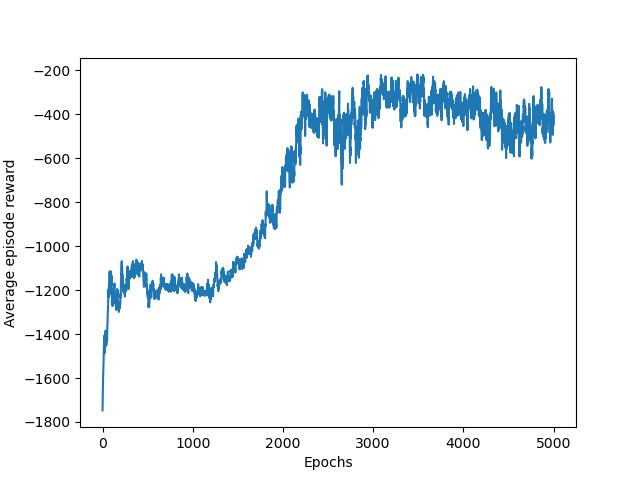
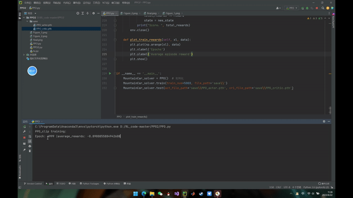

# PPO Algorithm based on gym
***Author***: Shiwei Liu, [College of Artificial Intelligence, Nankai University](https://aien.nankai.edu.cn/)

***E-mail***: 2011832@mail.nankai.edu.cn

## About this program
This project is one of my assignments for the course "Reinforcement Learning" during my junior year at Nankai University. It is used to train a stable module used [PPO(Proximal Policy Optimization)](https://arxiv.org/pdf/1707.06347.pdf) and solve some classic controlling problems such as inverted pendulum. I also used [gym](http://gym.openai.com/) to test the perfomance of the module.

## Requirements
1. Create a [conda](https://www.anaconda.com) environment by running this command(replace YOUR_ENV_NAME):
    ```
    conda create -n YOUR_ENV_NAME python==3.7 
    ```
    The python version must be 3.7.
2. Install CPU version [Pytorch](https://pytorch.org/):
    ```
    pip3 install torch torchvision torchaudio --index-url https://download.pytorch.org/whl/cu118
    ```
    You also need to install gym which is the simulation environment of this program:
    ```
    pip install gym==0.22.0
    ```
    The version of gym must be 0.22.0 otherwise this program will crash.
3. Use ```pip``` tool to install other required package:
    ```
    pip install numpy
    pip install pygame
    pip install matplotlib
    ```

## Run this program
1. Clone this project to your own PC:
    ```
    git clone https://github.com/SWL-SAMA/PPO_Algorithm_based_on_gym.git
    ```
2. Activate the conda environment created before ```conda activate YOUR_ENV_NAME``` and run this command (replace TRAIN_NUM):
    ```
    python PPO.py --run_mode=train --train_num=TRAIN_NUM
    ```
    Trained module will be saved as ```./trained_modules/PPO_actor.pth``` and ```./trained_modules/PPO_critic.pth```.

    Test trained models by running:
    ```
    python PPO.py --run_mode=test --train_num=0
    ```
## Result
When ```PPO.py``` finished the train function I use matplotlib to plot the curve of rewards:


We can test our trained models via gym:


You can write your own "test function" to visualize the training result.
